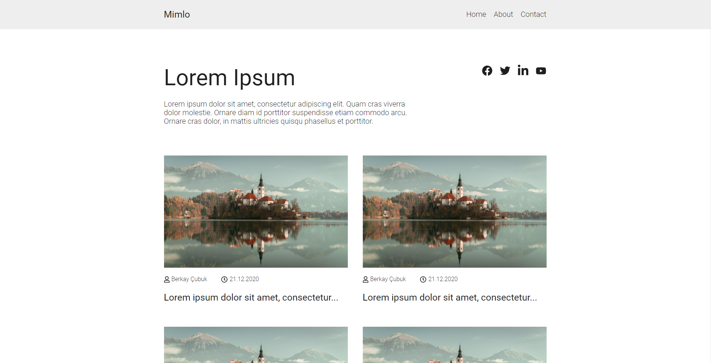
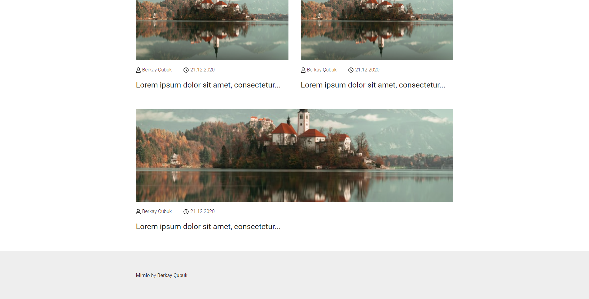
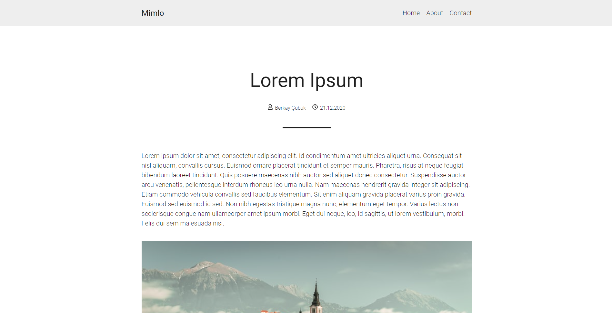

# Mimlo HTML Template

Mimlo is open-source, minimalist HTML blog template.

## How to use?

Just clone the repo and start using it.

> Note: To show your respect, please do not remove footer text.

## Screenshots

## Contributing

Feel free to create PR.

## License

This project uses MIT License.
